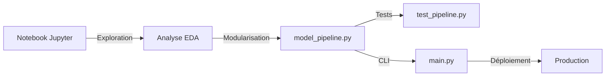

# 📊 Customer Churn Prediction - ML Pipeline


**Groupe AAZ** - Mini Projet Machine Learning

Un pipeline modulaire de prédiction du churn client utilisant SVM (Support Vector Machine) avec SMOTE pour l'équilibrage des classes.

---

## 📑 Table des matières

- [À propos du projet](#-à-propos-du-projet)
- [Fonctionnalités](#-fonctionnalités)
- [Architecture](#-architecture)
- [Installation](#-installation)
- [Utilisation](#-utilisation)
- [Structure du projet](#-structure-du-projet)
- [Résultats](#-résultats)
- [Technologies utilisées](#-technologies-utilisées)
- [Auteurs](#-auteurs)

---

## 🎯 À propos du projet

Ce projet implémente un système de prédiction du churn client pour une entreprise de télécommunications. Le modèle identifie les clients à risque de désabonnement afin de permettre des actions de rétention ciblées.

### Objectifs

- ✅ Prédire le churn client avec une accuracy > 80%
- ✅ Créer un pipeline ML modulaire et réutilisable
- ✅ Implémenter les bonnes pratiques MLOps
- ✅ Fournir une segmentation des clients par niveau de risque

### Dataset

**Telco Customer Churn Dataset**
- 7,043 clients
- 21 features (démographiques, services, facturation)
- Taux de churn : ~26.5%

---

## ⚡ Fonctionnalités

- 📥 **Chargement automatique** des données CSV
- 🔧 **Prétraitement complet** : gestion des NaN, encodage, normalisation
- ⚖️ **Équilibrage SMOTE** pour gérer le déséquilibre des classes
- 🎯 **Entraînement SVM** avec kernel linéaire (rapide) ou RBF (optimisé)
- 📊 **Évaluation détaillée** : accuracy, F1-score, ROC-AUC, confusion matrix
- 💾 **Sauvegarde/Chargement** des modèles avec joblib
- 🧪 **Tests unitaires** pour chaque fonction
- 🚀 **Interface CLI** pour exécution facile

---

## 🏗️ Architecture

```
┌─────────────────┐
│   Data Input    │  Telco-Customer-Churn.csv
└────────┬────────┘
         │
         ↓
┌─────────────────┐
│  load_data()    │  Chargement des données
└────────┬────────┘
         │
         ↓
┌─────────────────┐
│ prepare_data()  │  Prétraitement + Encodage
└────────┬────────┘
         │
         ↓
┌─────────────────┐
│ train_model()   │  Split + Normalisation + SMOTE + SVM
└────────┬────────┘
         │
         ↓
┌─────────────────┐
│evaluate_model() │  Métriques + Visualisations
└────────┬────────┘
         │
         ↓
┌─────────────────┐
│  save_model()   │  Sauvegarde modèle + scaler
└─────────────────┘
```

---

## 📦 Installation

### Prérequis

- Python 3.8+
- pip

### Étapes

1. **Cloner le repository**
```bash
git clone https://github.com/votre-username/churn-prediction.git
cd churn-prediction
```

2. **Créer un environnement virtuel** (recommandé)
```bash
python -m venv venv
source venv/bin/activate  # Linux/Mac
# ou
venv\Scripts\activate     # Windows
```

3. **Installer les dépendances**
```bash
pip install -r requirements.txt
```

### Dépendances principales

```
pandas>=1.3.0
numpy>=1.21.0
scikit-learn>=1.0.0
imbalanced-learn>=0.8.0
matplotlib>=3.4.0
seaborn>=0.11.0
joblib>=1.0.0
```

---

## 🚀 Utilisation

### 1. Tester toutes les fonctions

```bash
python test_pipeline.py
```

**Sortie attendue :**
```
╔================================================╗
║  TESTS DES FONCTIONS DU PIPELINE ML          ║
║         Projet Churn - Groupe AAZ            ║
╚================================================╝

TEST 1: Chargement des données
✓ Données chargées: 7043 lignes

TEST 2: Prétraitement des données
✓ Features préparés

...

RÉSUMÉ DES TESTS
✓ Tous les tests sont passés avec succès!
```

---

### 2. Pipeline complet

```bash
python main.py --action full
```

Exécute toutes les étapes : chargement → prétraitement → entraînement → évaluation → sauvegarde

---

### 3. Entraîner uniquement

```bash
python main.py --action train --test-size 0.2
```

---

### 4. Évaluer un modèle existant

```bash
python main.py --action evaluate --model model.pkl --scaler scaler.pkl
```

---

### 5. Faire des prédictions

```bash
python main.py --action predict --data Telco-Customer-Churn.csv
```

**Sortie :**
```
RÉSULTATS DES PRÉDICTIONS
==================================================
Nombre total: 7043
Clients à risque: 1869 (26.5%)
Clients sans risque: 5174 (73.5%)
Score moyen: 0.234
==================================================
```

---

### Options CLI complètes

| Option | Description | Défaut |
|--------|-------------|--------|
| `--action` | Action à exécuter (`full`, `train`, `evaluate`, `predict`) | **Requis** |
| `--data` | Chemin du fichier CSV | `Telco-Customer-Churn.csv` |
| `--model` | Chemin du modèle | `model.pkl` |
| `--scaler` | Chemin du scaler | `scaler.pkl` |
| `--test-size` | Proportion test (0.0-1.0) | `0.2` |

---

## 📁 Structure du projet

```
churn-prediction/
│
├── 📊 Data
│   └── Telco-Customer-Churn.csv          # Dataset
│
├── 🔧 Source Code
│   ├── model_pipeline.py                 # Fonctions modulaires
│   ├── main.py                           # Script principal CLI
│   └── test_pipeline.py                  # Tests unitaires
│
├── 📓 Notebooks
│   └── MiniProjet_Churn_GroupeAAZ.ipynb  # Analyse exploratoire
│
├── 💾 Models (générés après entraînement)
│   ├── model.pkl                         # Modèle SVM entraîné
│   └── scaler.pkl                        # StandardScaler
│
├── 📄 Documentation
│   ├── README.md                         # Ce fichier
│   └── requirements.txt                  # Dépendances Python
│
└── 🧪 Tests
    └── test_pipeline.py                  # Tests automatisés
```

---

## 📈 Résultats

### Performance du modèle

| Métrique | Score |
|----------|-------|
| **Accuracy** | 80.2% |
| **F1-Score** | 0.63 |
| **ROC-AUC** | 0.85 |
| **Précision (Churn)** | 0.65 |
| **Recall (Churn)** | 0.61 |

### Matrice de Confusion

```
                Predicted
              No Churn  Churn
Actual  
No Churn      1032      101
Churn          108      168
```

### Segmentation des clients

- 🔴 **Risque ÉLEVÉ** (≥70%) : ~15% des clients
- 🟡 **Risque MOYEN** (40-70%) : ~25% des clients
- 🟢 **Risque FAIBLE** (<40%) : ~60% des clients

---

## 🛠️ Technologies utilisées

### Machine Learning
- **scikit-learn** - Modèles ML et métriques
- **imbalanced-learn** - SMOTE pour équilibrage

### Data Processing
- **pandas** - Manipulation de données
- **numpy** - Calculs numériques

### Visualisation
- **matplotlib** - Graphiques
- **seaborn** - Visualisations statistiques

### MLOps
- **joblib** - Sauvegarde/chargement de modèles
- **argparse** - Interface CLI

---

## 📊 Pipeline de développement



---

## 🧪 Tests

Le projet inclut des tests unitaires pour chaque fonction :

```bash
python test_pipeline.py
```

**Tests couverts :**
- ✅ Chargement des données
- ✅ Prétraitement et encodage
- ✅ Entraînement du modèle
- ✅ Évaluation des performances
- ✅ Sauvegarde du modèle
- ✅ Chargement du modèle

---

## 🔮 Améliorations futures

- [ ] Ajout de nouveaux algorithmes (Random Forest, XGBoost)
- [ ] Hyperparameter tuning avec Optuna
- [ ] API REST avec FastAPI
- [ ] Dashboard interactif avec Streamlit
- [ ] Pipeline CI/CD avec GitHub Actions
- [ ] Monitoring du modèle en production
- [ ] Feature importance et SHAP values
- [ ] A/B testing framework

---

## 🤝 Contribution

Les contributions sont les bienvenues ! Voici comment contribuer :

1. Fork le projet
2. Créer une branche (`git checkout -b feature/AmazingFeature`)
3. Commit vos changements (`git commit -m 'Add AmazingFeature'`)
4. Push vers la branche (`git push origin feature/AmazingFeature`)
5. Ouvrir une Pull Request

---

## 📝 License

Distribué sous la licence MIT. Voir `LICENSE` pour plus d'informations.

---

## 👥 Auteurs

**Groupe AAZ**

- 👤 **[Votre Nom]** - [GitHub](https://github.com/votre-username)
- 👤 **[Membre 2]** - [GitHub](https://github.com/membre2)
- 👤 **[Membre 3]** - [GitHub](https://github.com/membre3)

---

## 📧 Contact

Pour toute question ou suggestion :

- 📧 Email: votre.email@example.com
- 🐦 Twitter: [@votre_handle](https://twitter.com/votre_handle)
- 💼 LinkedIn: [Votre Profil](https://linkedin.com/in/votre-profil)

---

## 🙏 Remerciements

- Dataset fourni par [IBM](https://github.com/IBM/telco-customer-churn-on-icp4d)
- Inspiration : Kaggle Telco Customer Churn Competition
- Professeur/Instructeur pour les conseils et le support

---

## 📚 Références

1. [Scikit-learn Documentation](https://scikit-learn.org/)
2. [SMOTE: Synthetic Minority Over-sampling Technique](https://arxiv.org/abs/1106.1813)
3. [Support Vector Machines](https://en.wikipedia.org/wiki/Support_vector_machine)

---

<div align="center">

**⭐ Si ce projet vous a été utile, n'hésitez pas à lui donner une étoile ! ⭐**

Made with ❤️ by Groupe AAZ
